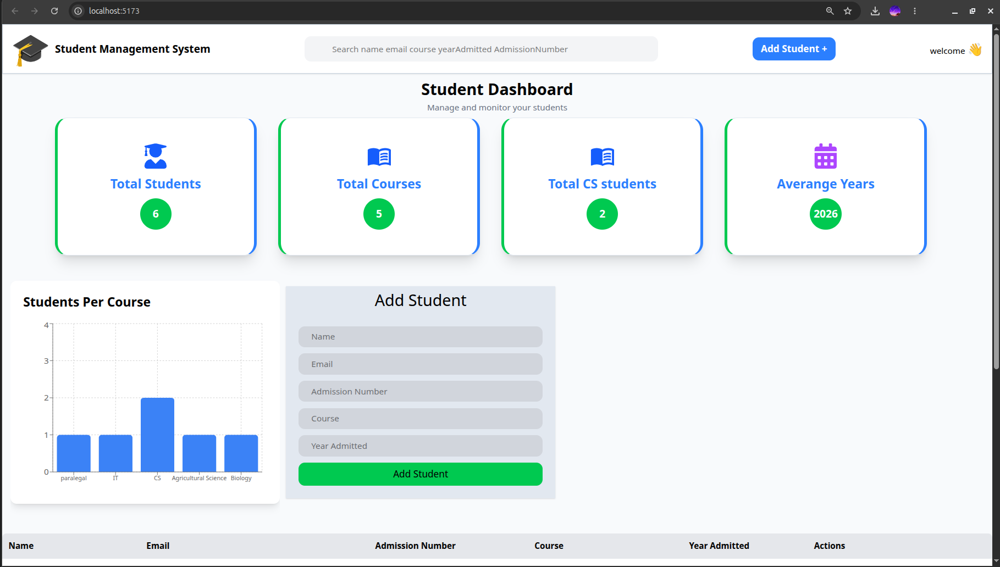
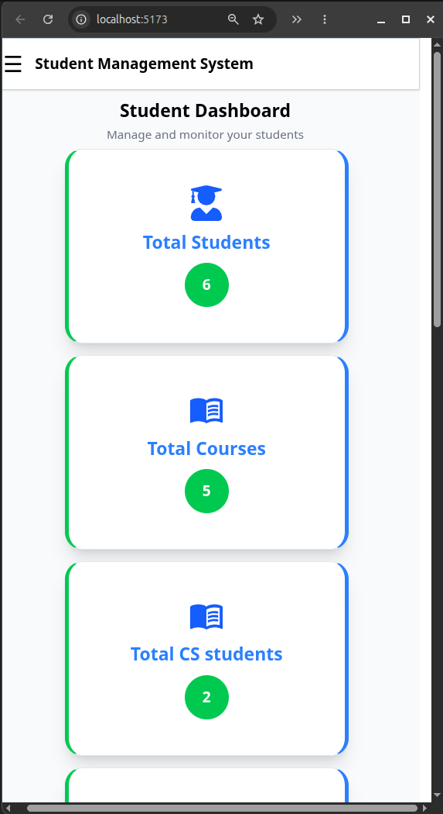
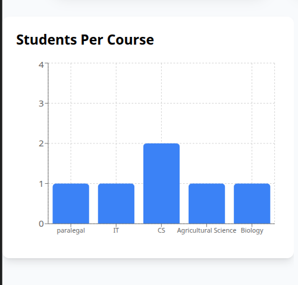
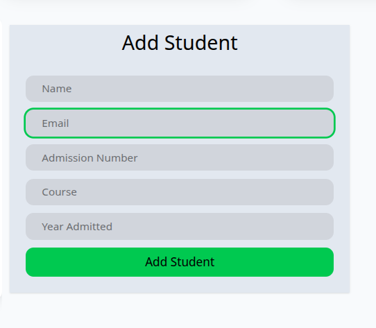
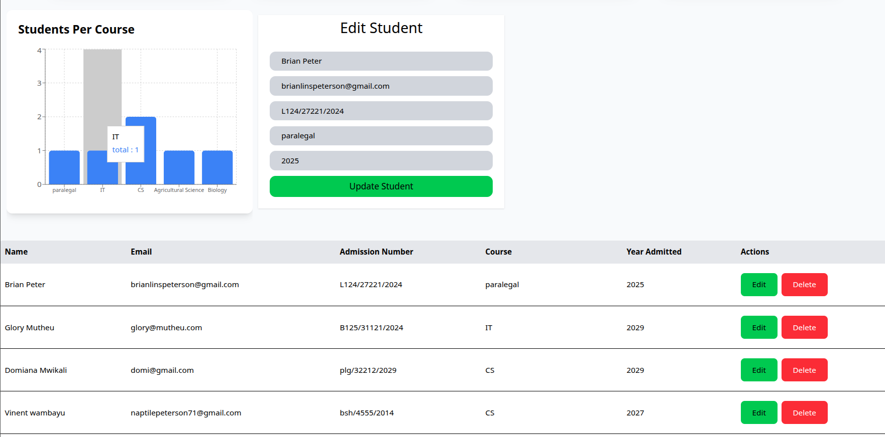
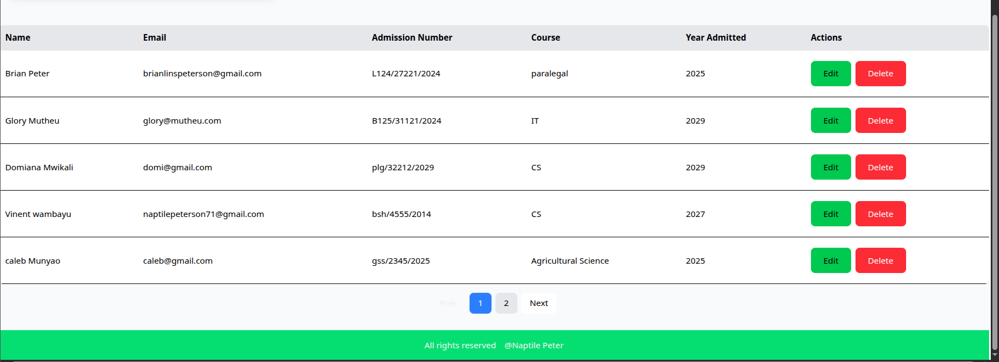

# 🎓 Student Management System

A full-stack **MERN Student Management System** built to practice and
demonstrate modern JavaScript, React, REST APIs, MongoDB, data
processing, responsive UI design, and dashboard visualization.

The application allows users to manage students, view statistics, search
and filter records, sort data, paginate results, and visualize students
by course.

------------------------------------------------------------------------

## 📸 Screenshots

> **Note:** Add your actual project screenshots to `screenshots/` using
> the filenames below. The README is already prepared to display them.

### 🖥️ Desktop Dashboard



### 📱 Mobile Dashboard



### 📊 Students Per Course Chart



### 📝 Add Student Form



### ✏️ Edit Student



### 📋 Student Table



### 🔎 Search and Filtering


------------------------------------------------------------------------

## ✨ Features

### 👨‍🎓 Student Management

-   Add new students
-   View all students
-   View individual student records
-   Edit existing students
-   Delete students
-   Confirmation before deletion
-   Form reset after submission
-   Edit mode with automatic form population

### 🔍 Search and Filtering

Students can be searched using information such as:

-   Name
-   Email
-   Course
-   Admission number
-   Year admitted

The application also supports filtering students by course.

### ↕️ Sorting

Student records can be sorted by different fields, including:

-   Name
-   Course
-   Year admitted

Sorting supports both:

-   Ascending order
-   Descending order

### 📄 Pagination

The student table includes pagination to avoid displaying every record
on one page.

Features include:

-   Current page tracking
-   Previous/Next navigation
-   Page number navigation
-   Automatic calculation of total pages
-   Handling of empty search/filter results

### 📊 Dashboard Statistics

The dashboard calculates useful statistics from the student data,
including:

-   Total number of students
-   Average admission year
-   Number of unique courses
-   Course distribution

### 📈 Data Visualization

The application uses **Recharts** to display student data visually.

Current visualization:

-   Students per course bar chart
-   Responsive chart container
-   Responsive chart sizing

### 🔔 Notifications

Toast notifications provide feedback when operations succeed or fail.

Examples:

-   Student added successfully
-   Student updated successfully
-   Errors from the API
-   Unexpected errors

### 📱 Responsive Design

The UI is designed to work across:

-   Mobile phones
-   Tablets
-   Laptops
-   Desktop monitors

Responsive techniques include:

-   Tailwind CSS breakpoints
-   Responsive grids
-   Flexible layouts
-   Mobile navigation menu
-   Responsive buttons
-   Horizontal table scrolling
-   Responsive charts
-   Responsive spacing and typography

------------------------------------------------------------------------

## 🛠️ Technologies Used

### Frontend

-   React
-   React Router
-   Tailwind CSS
-   Axios
-   Recharts
-   React Toast Notifications / Toast library

### Backend

-   Node.js
-   Express.js
-   MongoDB
-   Mongoose
-   REST API

### Development Tools

-   VS Code
-   Git
-   GitHub
-   MongoDB Compass / MongoDB Atlas

------------------------------------------------------------------------

## 🏗️ Application Architecture

``` text
                    Student Management System
                              │
             ┌────────────────┴────────────────┐
             │                                 │
        React Frontend                    Express Backend
             │                                 │
       ┌─────┴─────┐                     ┌─────┴─────┐
       │           │                     │           │
   Components   API Calls             Routes    Controllers
       │           │                     │           │
       │         Axios                  │        Mongoose
       │           │                     │           │
       └───────────┴─────────────────────┴───────────┘
                              │
                         MongoDB Database
```

------------------------------------------------------------------------

## 📁 Suggested Project Structure

``` text
student-management-system/
│
├── backend/
│   ├── controllers/
│   │   └── studentController.js
│   │
│   ├── models/
│   │   └── Student.js
│   │
│   ├── routes/
│   │   └── studentRoutes.js
│   │
│   ├── config/
│   │   └── db.js
│   │
│   ├── server.js
│   └── .env
│
├── frontend/
│   ├── src/
│   │   ├── components/
│   │   │   ├── Navbar.jsx
│   │   │   ├── StudentForm.jsx
│   │   │   ├── StudentTable.jsx
│   │   │   ├── StatCard.jsx
│   │   │   ├── Pagination.jsx
│   │   │   └── CourseCharts.jsx
│   │   │
│   │   ├── pages/
│   │   │   └── Home.jsx
│   │   │
│   │   ├── services/
│   │   │   └── api.js
│   │   │
│   │   ├── App.jsx
│   │   └── main.jsx
│   │
│   └── package.json
│
├── screenshots/
│   ├── dashboard-desktop.png
│   ├── dashboard-mobile.png
│   ├── course-chart.png
│   ├── student-form.png
│   ├── edit-student.png
│   ├── student-table.png
│   └── search-filter.png
│
└── README.md
```

------------------------------------------------------------------------

## 🗄️ Student Data Model

A student record contains fields such as:

``` javascript
{
    name: String,
    email: String,
    admissionNumber: String,
    yearAdmitted: Number,
    course: String
}
```

The backend uses Mongoose to define and validate the schema.

------------------------------------------------------------------------

## 🔌 REST API

The backend exposes RESTful endpoints for student management.

  Method   Endpoint              Purpose
  -------- --------------------- ------------------
  GET      `/api/students`       Get all students
  GET      `/api/students/:id`   Get one student
  POST     `/api/students`       Create a student
  PUT      `/api/students/:id`   Update a student
  DELETE   `/api/students/:id`   Delete a student

------------------------------------------------------------------------

## 🧠 JavaScript Concepts Practiced

This project was designed around practical JavaScript data-processing
concepts.

### `map()`

Used to transform data.

``` javascript
students.map(student => student.name);
```

### `filter()`

Used to select matching records.

``` javascript
students.filter(student => student.course === "IT");
```

### `find()`

Used to find the first matching student.

``` javascript
students.find(student => student.name === "Brian");
```

### `some()`

Used to check whether at least one item satisfies a condition.

``` javascript
students.some(student => student.marks > 80);
```

### `reduce()`

Used heavily for dashboard statistics.

``` javascript
const totalYears = students.reduce(
    (acc, student) => acc + student.yearAdmitted,
    0
);
```

It was also used to generate course statistics:

``` javascript
const courseStats = students.reduce((acc, student) => {
    if (student.course in acc) {
        acc[student.course] += 1;
    } else {
        acc[student.course] = 1;
    }

    return acc;
}, {});
```

### `Object.entries()`

Used to transform an object into an array of key-value pairs for chart
data.

``` javascript
const chartData = Object.entries(courseStats).map(
    ([course, total]) => ({
        course,
        total
    })
);
```

### `Set`

Used for working with unique values.

``` javascript
const uniqueCourses = new Set(
    students.map(student => student.course)
).size;
```

### `sort()`

Used for sorting student records.

``` javascript
const sortedStudents = [...students].sort(
    (a, b) => a.yearAdmitted - b.yearAdmitted
);
```

The spread operator is used so the original `students` array is not
directly mutated.

### `Array.from()`

Used for generating pagination page numbers.

``` javascript
Array.from(
    { length: totalPages },
    (_, index) => index + 1
);
```

------------------------------------------------------------------------

## ⚛️ React Concepts Practiced

### State Management

``` javascript
const [students, setStudents] = useState([]);
```

Other application states include:

-   `loading`
-   `search`
-   `selectedCourse`
-   `editingStudent`
-   `currentPage`
-   `sortField`
-   `sortDirection`
-   `menuOpen`

### `useEffect`

Used for fetching data and reacting to changes.

``` javascript
useEffect(() => {
    fetchStudents();
}, []);
```

It is also used to populate the form when editing a student.

### Conditional Rendering

``` jsx
{loading && <p>Loading...</p>}
```

and:

``` jsx
{editingStudent ? "Update Student" : "Add Student"}
```

### Component Reusability

The application separates functionality into reusable components such
as:

``` text
Navbar
StudentForm
StudentTable
StatCard
Pagination
CourseCharts
```

------------------------------------------------------------------------

## 📊 Data Processing Flow

The application processes student data through several stages:

``` text
Students from API
        │
        ↓
Search
        │
        ↓
Course Filter
        │
        ↓
Sorting
        │
        ↓
Pagination
        │
        ↓
Student Table
```

Dashboard statistics use the complete student collection independently:

``` text
Students
   │
   ├── reduce() → Total students/statistics
   │
   ├── Set → Unique courses
   │
   └── reduce() → Course statistics
                    │
                    ↓
             Object.entries()
                    │
                    ↓
              Chart Data
                    │
                    ↓
              Recharts
```

------------------------------------------------------------------------

## 📱 Responsive Design

The application follows a mobile-first approach using Tailwind CSS.

Examples include:

``` jsx
className="grid grid-cols-1 sm:grid-cols-2 lg:grid-cols-4"
```

``` jsx
className="flex flex-col md:flex-row"
```

``` jsx
className="w-full sm:w-auto"
```

``` jsx
className="hidden md:flex"
```

``` jsx
className="block md:hidden"
```

The student table uses horizontal scrolling when necessary:

``` jsx
<div className="overflow-x-auto">
    <table className="min-w-full">
        ...
    </table>
</div>
```

Charts use Recharts' responsive container:

``` jsx
<ResponsiveContainer width="100%" height="100%">
```

------------------------------------------------------------------------

## 📈 Responsive Course Chart

The course chart converts course statistics into chart-friendly data:

``` javascript
const courseStats = students.reduce((acc, student) => {
    if (student.course in acc) {
        acc[student.course] += 1;
    } else {
        acc[student.course] = 1;
    }

    return acc;
}, {});

const chartData = Object.entries(courseStats).map(
    ([course, total]) => ({
        course,
        total
    })
);
```

The chart is placed inside a responsive container so it can adapt to its
parent:

``` jsx
<ResponsiveContainer width="100%" height="100%">
    <BarChart data={chartData}>
        ...
    </BarChart>
</ResponsiveContainer>
```

------------------------------------------------------------------------

## ⚙️ Installation

### 1. Clone the repository

``` bash
git clone YOUR_REPOSITORY_URL
```

### 2. Enter the project

``` bash
cd student-management-system
```

### 3. Install backend dependencies

``` bash
cd backend
npm install
```

### 4. Configure environment variables

Create:

``` text
.env
```

Example:

``` env
MONGO_URI=your_mongodb_connection_string
PORT=5000
```

Do **not** commit your `.env` file to GitHub.

### 5. Start the backend

``` bash
npm run dev
```

### 6. Install frontend dependencies

``` bash
cd ../frontend
npm install
```

### 7. Start the frontend

``` bash
npm run dev
```

------------------------------------------------------------------------

## 🔐 Environment Variables

The backend requires environment variables such as:

``` env
MONGO_URI=your_mongodb_uri
PORT=5000
```

Make sure `.env` is included in `.gitignore`:

``` gitignore
.env
node_modules/
dist/
```

------------------------------------------------------------------------

## 🧪 Testing Checklist

Before considering the project complete, test:

-   [ ] Add student
-   [ ] View students
-   [ ] Edit student
-   [ ] Cancel editing
-   [ ] Delete student
-   [ ] Search by name
-   [ ] Search by email
-   [ ] Search by course
-   [ ] Search by admission number
-   [ ] Filter by course
-   [ ] Sort ascending
-   [ ] Sort descending
-   [ ] Navigate pagination
-   [ ] Empty search result
-   [ ] Loading state
-   [ ] API error handling
-   [ ] Toast notifications
-   [ ] Responsive navbar
-   [ ] Responsive cards
-   [ ] Responsive form
-   [ ] Responsive table
-   [ ] Responsive pagination
-   [ ] Responsive chart

------------------------------------------------------------------------

## 🎯 Learning Objectives

This project helped practice the complete flow of a MERN application:

``` text
JavaScript
    ↓
React
    ↓
REST API
    ↓
Express
    ↓
MongoDB
    ↓
Mongoose
    ↓
React + API integration
    ↓
Data processing
    ↓
Dashboard statistics
    ↓
Charts
    ↓
Responsive UI
```

The project also emphasizes writing reusable components instead of
putting the entire application into one component.

------------------------------------------------------------------------

## 🚀 Future Improvements

Possible future features include:

-   Authentication and authorization
-   Admin and student roles
-   Student profile pages
-   Export students to CSV/PDF
-   More dashboard charts
-   Course management
-   Advanced filtering
-   Dark mode
-   Server-side pagination
-   Form validation
-   Deployment
-   Unit and integration tests
-   Better accessibility
-   Confirmation modals
-   Student image/profile support

------------------------------------------------------------------------

## 👨‍💻 Project Status

**Status:** ✅ Functional / Learning Project

The project is primarily designed as a practical learning project for
understanding full-stack development and modern React application
patterns.

------------------------------------------------------------------------

## 📚 Key Takeaway

The biggest goal of this project is not simply to create a student CRUD
application.

It is to understand how individual programming concepts work together:

``` text
JavaScript array methods
          +
React state
          +
React effects
          +
Reusable components
          +
REST APIs
          +
Express
          +
MongoDB
          +
Mongoose
          +
Data visualization
          +
Responsive design
          =
A complete full-stack application
```

------------------------------------------------------------------------

## ⭐ If you found this project useful

Feel free to star the repository and use the project as a reference for
learning MERN stack development.
